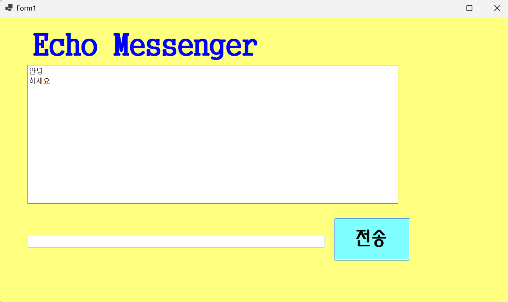
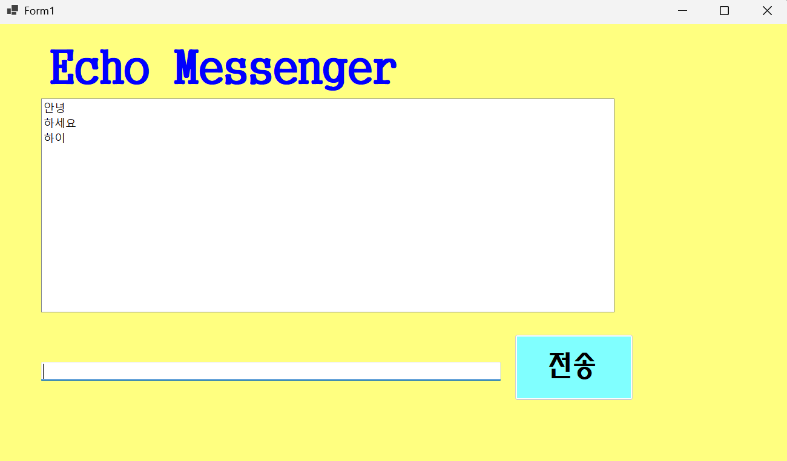
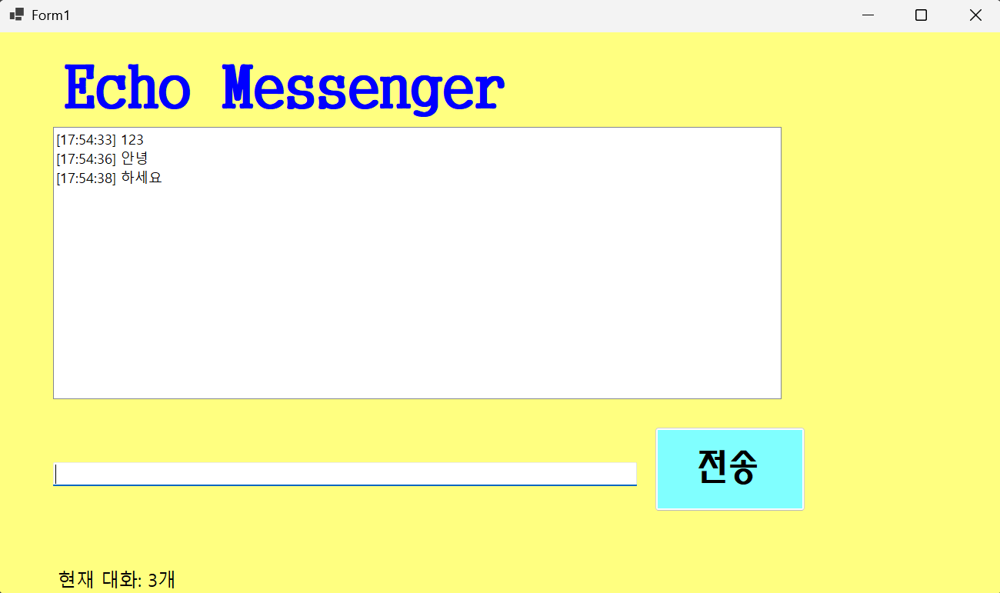
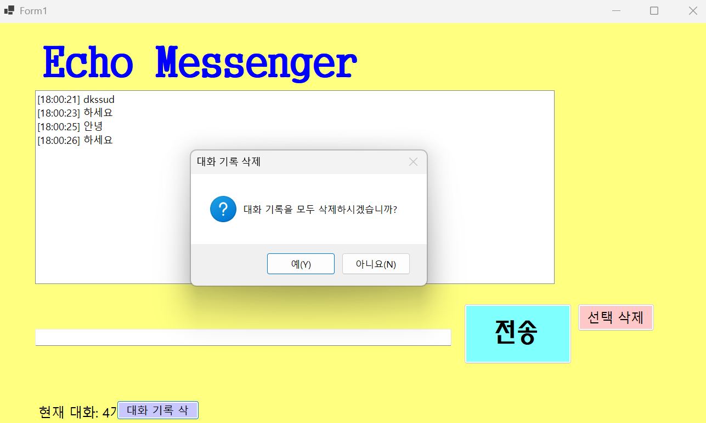
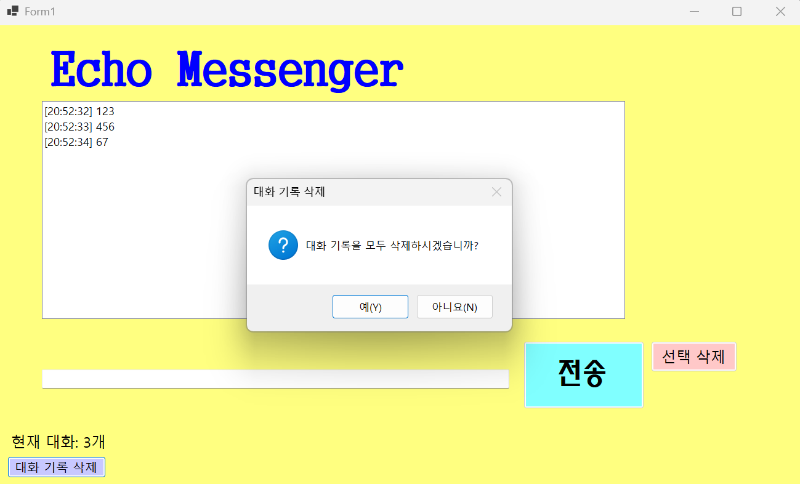
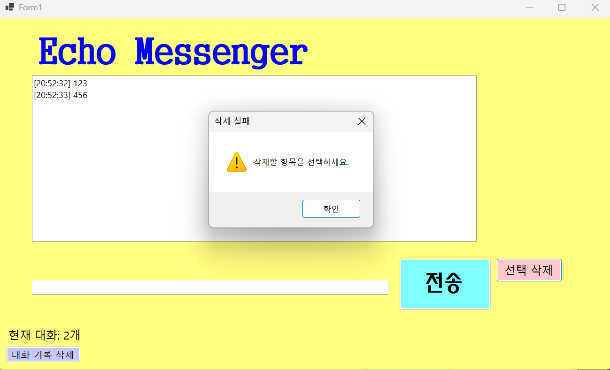

# (C# 코딩) 에코 메신저

## 개요
- C# 프로그래밍 학습
- 1줄 소개: 사용자 키보드 입력을 받아서 처리하는 프로그램
- 사용한 플랫폼:
	- C#, .NET Windows Forms, Visual Studio, GitHub
- 사용한 컨트롤:
	- Label, TextBox, ListBox, Button
- 사용한 기술과 구현한 기능:
	- Visual Studio를 이용하여 UI 디자인
	- string 클래스를 이용한 사용자 입력 데이터 처리
	- 텍스트 추가 직후 텍스트박스의 내용 삭제
	- 전송 후 커서 자동 배치
	- Enter 키를 눌러 메시지 전송 가능
	- 내용 없는 메세지 전송 방지
	- 리스트에 쌓인 총 메시지 개수 업데이트
	- 메시지의 앞뒤 불필요한 공백 제거
	- DateTime 클래스를 이용한 현재시간 정보 구하기
	- 특정 메세지 제거를 위한 '삭제'버튼 구현
	- 모든 내용을 삭제하는 '대화 기록 삭제' 버튼 구현
	- 입력창에 글자 수를 50자로 제한하고, 초과시 사용자에게 전송을 차단

## 실행 화면 (과제1)
- 과제1 코드의 실행 스크린샷

- 과제 내용
	- UI 구성
	- 전송 기능
	- 입력창 정리

- 구현 내용과 기능 설명
	- 입력창에 메시지 입력하고 전송 버튼을 누르면 메시지가 리스트 박스에 표시된다.
	- 전송 버튼 클릭 시 메시지가 리스트 박스에 한 줄씩 계속 추가된다.
	- 추가 직후 텍스트박스의 내용이 지워져서 다음 메시지를 입력할 수 있다.

- 사용한 기술과 구현한 기능:
   - Label(표시), TextBox(입력), Button(전송), ListBox(대화창)를 적절히 배치
   - 전송 버튼 클릭 시 TextBox의 텍스트를 ListBox의 항목으로 추가
   - 추가 직후 TextBox의 내용을 비워 다음 입력을 준비

## 실행 화면 (과제2)
- 과제2 코드의 실행 스크린샷

- 과제 내용
	- 입력창의 기존 메시지 지우기
	- 입력창에 입력 포커스 갖다 놓기
	- 엔터키로 전송하기
	- 엔터 방어

- 구현 내용과 기능 설명
	- 전송이 끝나면 입력창에 남겨진 기존 메시지를 삭제합니다.
	- 전송 후에 마우스로 입력창을 다시 클릭하지 않아도 되도록 커서를 자동으로 입력창에둡니다.
	- 마우스 클릭 대신 키보드의 Enter 키를 눌러도 메시지가 전송되도록 합니다.
	- 내용이 없는 빈 문자열이나 공백(Space)만 있을 때는 메시지가 전송되지 않도록 방지합니다.

- 사용한 기술과 구현한 기능:
   - Trim() 함수를 사용하여 무의미한 공백이나 빈 문자열 전송을 차단
   - Clear()와 Focus() 메서드를 연계하여 전송 완료 후 즉시 다음 입력을 할 수 있도록 UX를 개선
   - KeyDown 이벤트를 감지하여 마우스 클릭 없이 Enter 키만으로 메시지를 전송할 수 있게 구현

## 실행 화면 (과제3)
- 과제3 코드의 실행 스크린샷

- 과제 내용
	- 타임스탬프 추가
	- 메시지 카운팅
	- 문자열 정제

- 구현 내용과 기능 설명
	- 메시지 앞에 현재 시간([14:20:05])을 자동으로 결합하여 리스트에 출력합니다.
	- 현재 리스트에 쌓인 총 메시지 개수를 계산하여 하단 Label에 실시간으로 업데이트합니다.
	- 사용자가 입력한 메시지의 앞뒤 불필요한 공백을 Trim() 함수로 제거하여 저장합니다.

- 사용한 기술과 구현한 기능:
	- DateTime.Now 객체와 커스텀 포맷 스트링("HH:mm:ss")을 결합하여 채팅 타임스탬프를 생성
	- Items.Add()와 Items.Count 속성을 연동하여 메시지 추가와 개수 산정을 실시간으로 동기화
	- Trim() 메서드를 활용해 의미 없는 선후행 공백을 제거함으로써 데이터의 일관성을 유지
	- TopIndex 속성 제어를 통해 새 메시지가 추가될 때마다 최하단으로 자동 스크롤되는 채팅 편의 기능을 구현
   

## 실행 화면 (과제4)
- 과제4 코드의 실행 스크린샷

- 과제 내용
	- 선택 항목 삭제
	- 전체 초기화
	- 글자 수 제한

- 구현 내용과 기능 설명
	- ListBox에서 특정 메시지를 마우스로 클릭하고 '삭제' 버튼을 누르면 해당 항목만 목록에서 제거합니다. (단, 선택하지 않고 삭제 시 발생하는 에러를 예외 처리해야 함)
	- '대화 기록 삭제' 버튼을 클릭하면 리스트의 모든 내용을 한 번에 지웁니다.
	- 입력창에 글자 수를 50자로 제한하고, 초과시 사용자에게 전송을 차단합니다.

- 사용한 기술과 구현한 기능:
	- try-catch 블록과 SelectedIndex 유효성 검사를 통해 항목 미선택 상태에서 발생할 수 있는 런타임 오류를 사전에 차단
	- Items.RemoveAt()과 Items.Clear() 메서드를 활용하여 메모리상의 데이터와 화면상의 리스트뷰를 동기화
	- MessageBox.Show()의 MessageBoxButtons.YesNo 옵션을 활용하여 전체 삭제 시 사용자의 실수에 의한 데이터 소실을 방지
	- 문자열의 Length 속성을 활용해 데이터 전송 전 50자 초과 여부를 동적으로 검사하고 시각적 피드백(MessageBoxIcon.Warning)을 제공
   